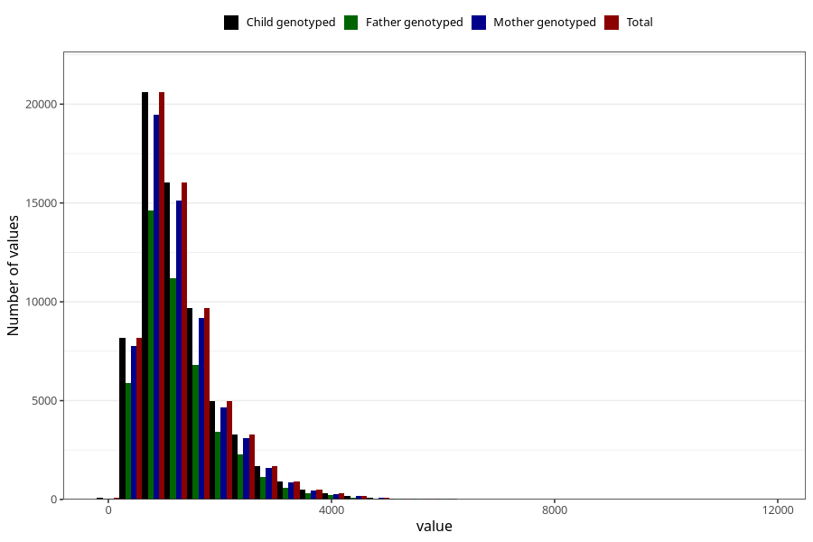

# total_retinol
Variable mapping to `RET_EKVIV` in `Skjema2_beregning_CDW_v12`.
- Number of values:

| Value | Total | Child genotyped | Mother genotyped | Father genotyped |
| ----- | ----- | --------------- | ---------------- | ---------------- |
| Missing | 14320 | 14320 | 13635 | 6744 |
| Non-missing | 66685 | 66685 | 62982 | 46860 |
| 25th percentile | 769.45 | 769.45 | 769.4875 | 764.575 |
| 50th percentile | 1106.97 | 1106.97 | 1107.195 | 1098.745 |
| 75th percentile | 1594.06 | 1594.06 | 1594.2775 | 1579.895 |
| Mean | 1289.85335442753 | 1289.85335442753 | 1289.1938693595 | 1279.05816752027 |
| Standard deviation | 752.8995173697 | 752.8995173697 | 751.145017988879 | 745.566771027084 |
| N | 66685 | 66685 | 62982 | 46860 |

