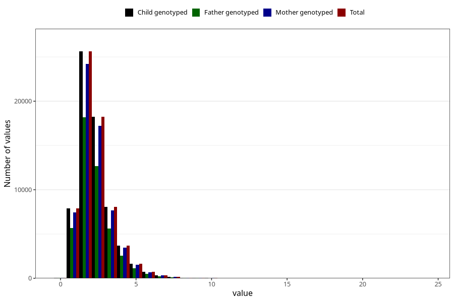

# trans_fatty_acids
Variable mapping to `TOT_TRANS` in `Skjema2_beregning_CDW_v12`.
- Number of values:

| Value | Total | Child genotyped | Mother genotyped | Father genotyped |
| ----- | ----- | --------------- | ---------------- | ---------------- |
| Missing | 14320 | 14320 | 13635 | 6744 |
| Non-missing | 66685 | 66685 | 62982 | 46860 |
| 25th percentile | 1.54 | 1.54 | 1.54 | 1.53 |
| 50th percentile | 2.07 | 2.07 | 2.07 | 2.05 |
| 75th percentile | 2.79 | 2.79 | 2.79 | 2.77 |
| Mean | 2.31969003524031 | 2.31969003524031 | 2.31821901495665 | 2.29848250106701 |
| Standard deviation | 1.16164760269872 | 1.16164760269872 | 1.15817953308297 | 1.13910423872906 |
| N | 66685 | 66685 | 62982 | 46860 |

