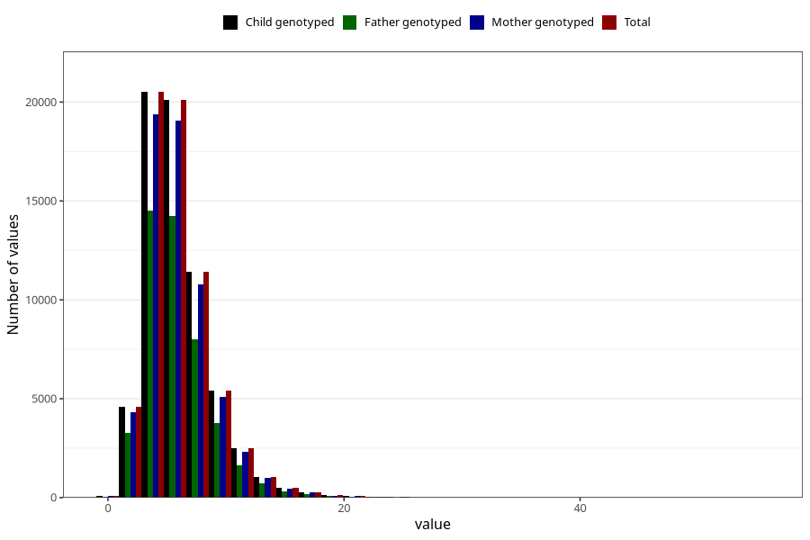

# vitamin_b12
Variable mapping to `VIT_B12` in `Skjema2_beregning_CDW_v12`.
- Number of values:

| Value | Total | Child genotyped | Mother genotyped | Father genotyped |
| ----- | ----- | --------------- | ---------------- | ---------------- |
| Missing | 14320 | 14320 | 13635 | 6744 |
| Non-missing | 66685 | 66685 | 62982 | 46860 |
| 25th percentile | 4.05 | 4.05 | 4.05 | 4.04 |
| 50th percentile | 5.43 | 5.43 | 5.42 | 5.41 |
| 75th percentile | 7.29 | 7.29 | 7.28 | 7.25 |
| Mean | 5.99393641748519 | 5.99393641748519 | 5.99018195674955 | 5.95496308151942 |
| Standard deviation | 2.84338296232179 | 2.84338296232179 | 2.83789745189789 | 2.78824366177558 |
| N | 66685 | 66685 | 62982 | 46860 |

