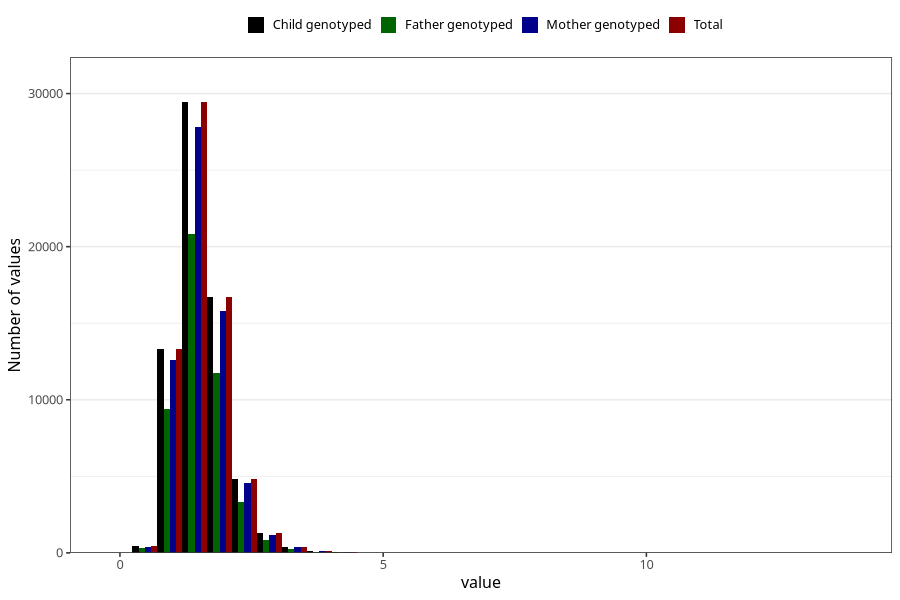

# vitamin_b6
Variable mapping to `VIT_B6` in `Skjema2_beregning_CDW_v12`.
- Number of values:

| Value | Total | Child genotyped | Mother genotyped | Father genotyped |
| ----- | ----- | --------------- | ---------------- | ---------------- |
| Missing | 14320 | 14320 | 13635 | 6744 |
| Non-missing | 66685 | 66685 | 62982 | 46860 |
| 25th percentile | 1.23 | 1.23 | 1.23 | 1.23 |
| 50th percentile | 1.49 | 1.49 | 1.49 | 1.49 |
| 75th percentile | 1.79 | 1.79 | 1.79 | 1.79 |
| Mean | 1.55809822298868 | 1.55809822298868 | 1.55699437934648 | 1.55189393939394 |
| Standard deviation | 0.499148979090137 | 0.499148979090137 | 0.497368097876629 | 0.486226606679368 |
| N | 66685 | 66685 | 62982 | 46860 |

