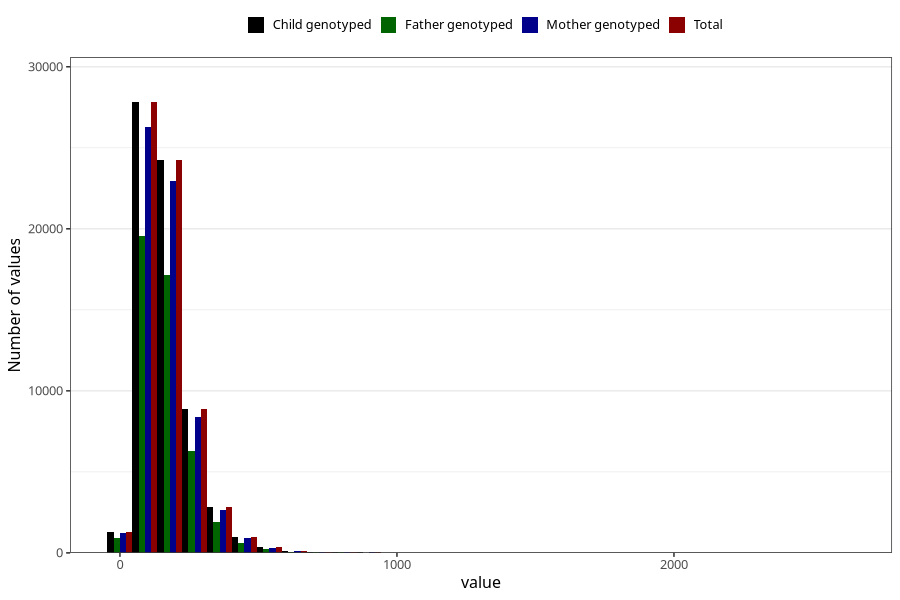

# vitamin_c
Variable mapping to `ASKORBIN` in `Skjema2_beregning_CDW_v12`.
- Number of values:

| Value | Total | Child genotyped | Mother genotyped | Father genotyped |
| ----- | ----- | --------------- | ---------------- | ---------------- |
| Missing | 14320 | 14320 | 13635 | 6744 |
| Non-missing | 66685 | 66685 | 62982 | 46860 |
| 25th percentile | 101.77 | 101.77 | 101.73 | 101.7 |
| 50th percentile | 146.73 | 146.73 | 146.68 | 146.455 |
| 75th percentile | 206.29 | 206.29 | 205.98 | 205.16 |
| Mean | 166.163428057284 | 166.163428057284 | 165.945560477597 | 165.072222577892 |
| Standard deviation | 97.2647202474872 | 97.2647202474872 | 96.7615517528166 | 95.0854037294173 |
| N | 66685 | 66685 | 62982 | 46860 |

