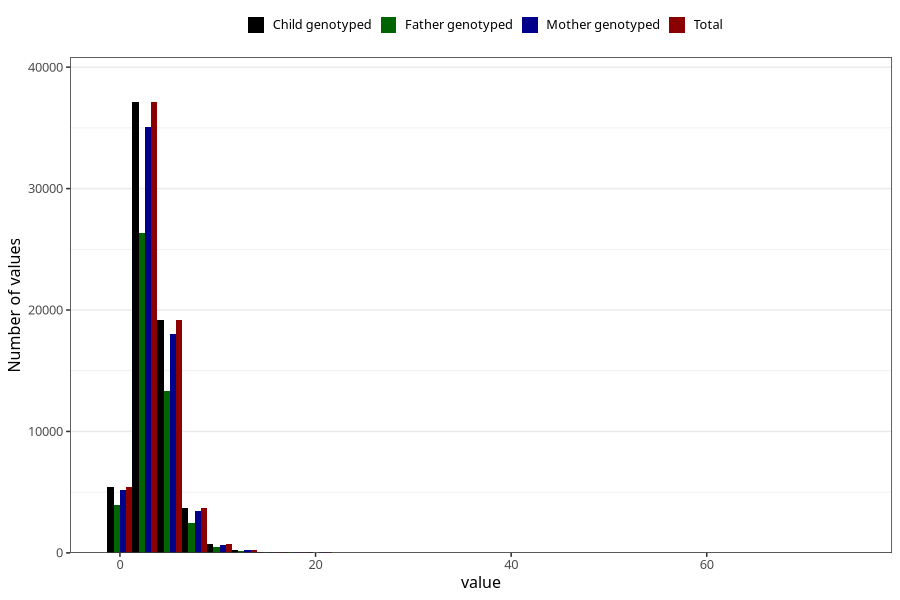

# vitamin_d
Variable mapping to `VIT_D` in `Skjema2_beregning_CDW_v12`.
- Number of values:

| Value | Total | Child genotyped | Mother genotyped | Father genotyped |
| ----- | ----- | --------------- | ---------------- | ---------------- |
| Missing | 14320 | 14320 | 13635 | 6744 |
| Non-missing | 66685 | 66685 | 62982 | 46860 |
| 25th percentile | 2.13 | 2.13 | 2.13 | 2.11 |
| 50th percentile | 3.19 | 3.19 | 3.19 | 3.15 |
| 75th percentile | 4.44 | 4.44 | 4.44 | 4.4 |
| Mean | 3.55359151233411 | 3.55359151233411 | 3.5479856149376 | 3.50594899701238 |
| Standard deviation | 2.38473530486061 | 2.38473530486061 | 2.38090060725094 | 2.36189878937486 |
| N | 66685 | 66685 | 62982 | 46860 |

