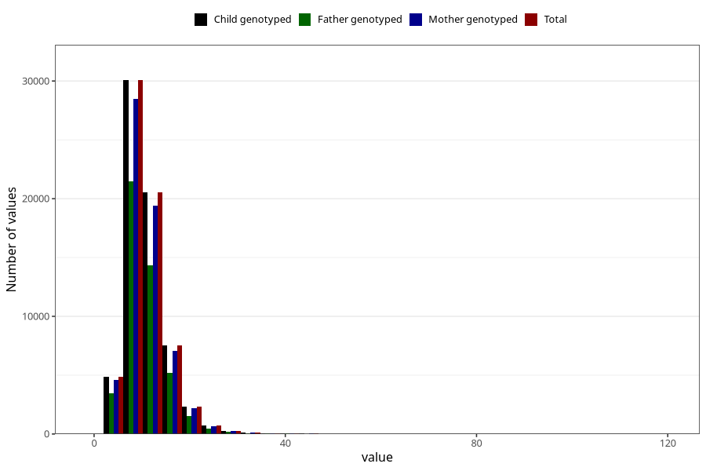

# vitamin_ed
Variable mapping to `VIT_E` in `Skjema2_beregning_CDW_v12`.
- Number of values:

| Value | Total | Child genotyped | Mother genotyped | Father genotyped |
| ----- | ----- | --------------- | ---------------- | ---------------- |
| Missing | 14320 | 14320 | 13635 | 6744 |
| Non-missing | 66685 | 66685 | 62982 | 46860 |
| 25th percentile | 7.95 | 7.95 | 7.94 | 7.9 |
| 50th percentile | 10 | 10 | 9.99 | 9.93 |
| 75th percentile | 12.81 | 12.81 | 12.78 | 12.69 |
| Mean | 10.9021905975857 | 10.9021905975857 | 10.8916107776825 | 10.8047055057618 |
| Standard deviation | 4.59111031358925 | 4.59111031358925 | 4.58847803720737 | 4.49341838711226 |
| N | 66685 | 66685 | 62982 | 46860 |

