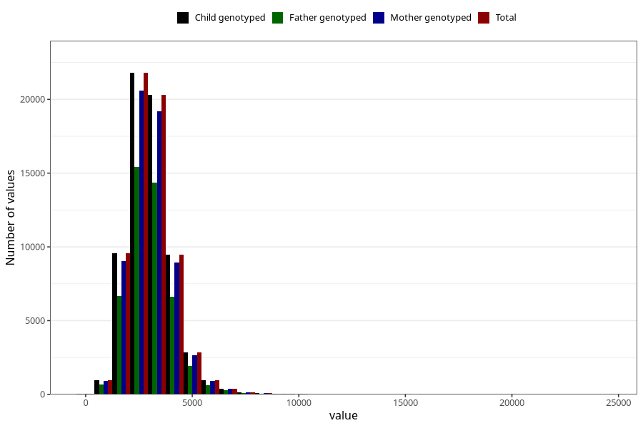

# water_g
Variable mapping to `VANN_G` in `Skjema2_beregning_CDW_v12`.
- Number of values:

| Value | Total | Child genotyped | Mother genotyped | Father genotyped |
| ----- | ----- | --------------- | ---------------- | ---------------- |
| Missing | 14320 | 14320 | 13635 | 6744 |
| Non-missing | 66685 | 66685 | 62982 | 46860 |
| 25th percentile | 2349.16 | 2349.16 | 2349.365 | 2349.7 |
| 50th percentile | 2959.27 | 2959.27 | 2958.415 | 2956.575 |
| 75th percentile | 3620.9 | 3620.9 | 3619 | 3609.405 |
| Mean | 3067.21923071155 | 3067.21923071155 | 3065.92786875615 | 3058.27887537345 |
| Standard deviation | 1078.3138467728 | 1078.3138467728 | 1078.19103957894 | 1057.36140695358 |
| N | 66685 | 66685 | 62982 | 46860 |

