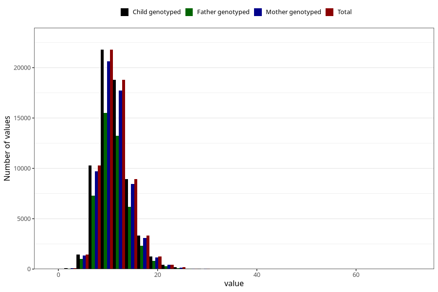

# zinc
Variable mapping to `SINK` in `Skjema2_beregning_CDW_v12`.
- Number of values:

| Value | Total | Child genotyped | Mother genotyped | Father genotyped |
| ----- | ----- | --------------- | ---------------- | ---------------- |
| Missing | 14320 | 14320 | 13635 | 6744 |
| Non-missing | 66685 | 66685 | 62982 | 46860 |
| 25th percentile | 9.18 | 9.18 | 9.18 | 9.16 |
| 50th percentile | 10.97 | 10.97 | 10.97 | 10.94 |
| 75th percentile | 13.03 | 13.03 | 13.02 | 12.97 |
| Mean | 11.351956661918 | 11.351956661918 | 11.3467754279 | 11.2987183098592 |
| Standard deviation | 3.28520425970654 | 3.28520425970654 | 3.27812858787707 | 3.21240089132425 |
| N | 66685 | 66685 | 62982 | 46860 |

