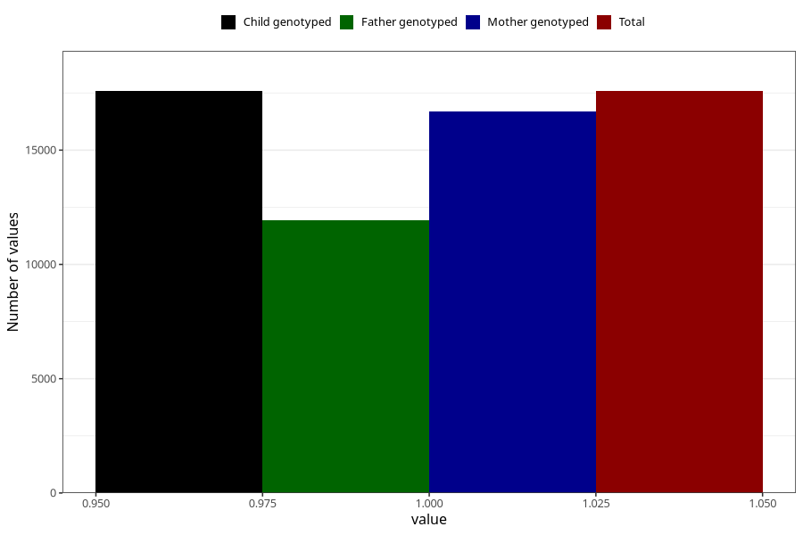

# contraception_used_condom
Variable mapping to `AA28` in `Skjema1_v12`.
- Number of values:

| Value | Total | Child genotyped | Mother genotyped | Father genotyped |
| ----- | ----- | --------------- | ---------------- | ---------------- |
| Missing | 63424 | 63424 | 59937 | 41661 |
| Non-missing | 17581 | 17581 | 16680 | 11943 |
| 1 | 17581 | 17581 | 16680 | 11943 |

