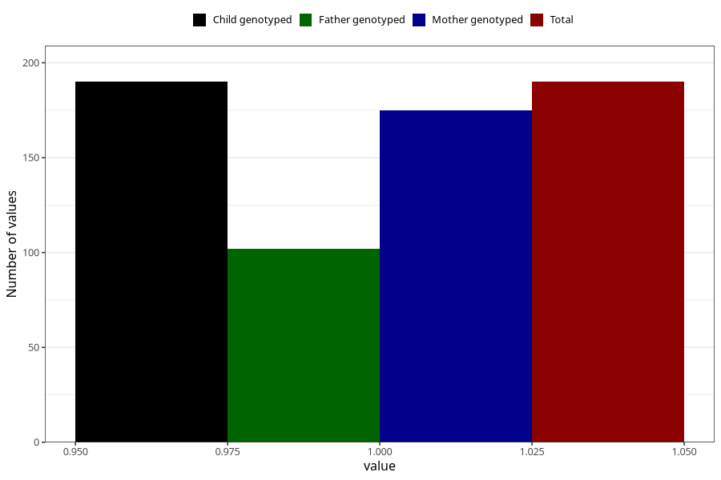

# contraception_used_diaphragm
Variable mapping to `AA29` in `Skjema1_v12`.
- Number of values:

| Value | Total | Child genotyped | Mother genotyped | Father genotyped |
| ----- | ----- | --------------- | ---------------- | ---------------- |
| Missing | 80815 | 80815 | 76442 | 53502 |
| Non-missing | 190 | 190 | 175 | 102 |
| 1 | 190 | 190 | 175 | 102 |

