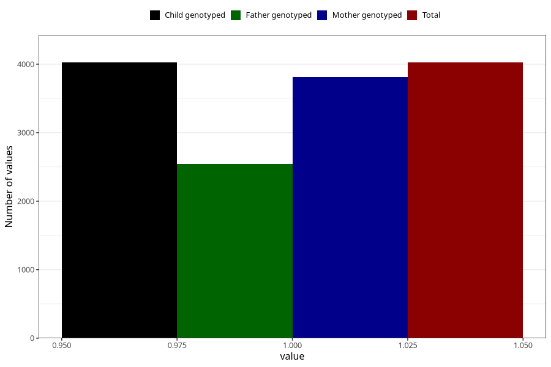

# contraception_used_iud
Variable mapping to `AA30` in `Skjema1_v12`.
- Number of values:

| Value | Total | Child genotyped | Mother genotyped | Father genotyped |
| ----- | ----- | --------------- | ---------------- | ---------------- |
| Missing | 76981 | 76981 | 72804 | 51062 |
| Non-missing | 4024 | 4024 | 3813 | 2542 |
| 1 | 4024 | 4024 | 3813 | 2542 |

