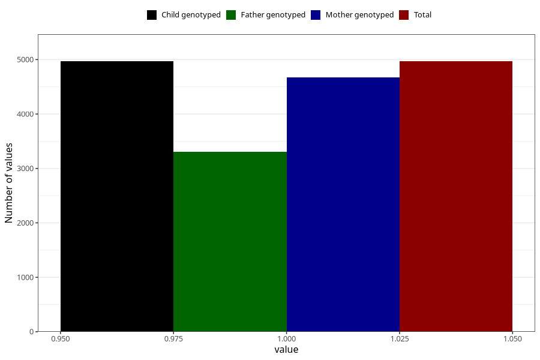

# contraception_used_mini_pill
Variable mapping to `AA33` in `Skjema1_v12`.
- Number of values:

| Value | Total | Child genotyped | Mother genotyped | Father genotyped |
| ----- | ----- | --------------- | ---------------- | ---------------- |
| Missing | 76037 | 76037 | 71948 | 50300 |
| Non-missing | 4968 | 4968 | 4669 | 3304 |
| 1 | 4968 | 4968 | 4669 | 3304 |

