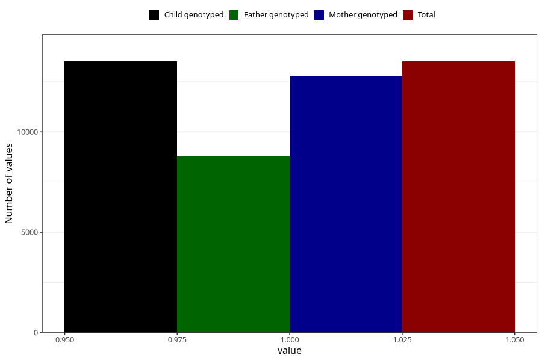

# contraception_used_no_such_method
Variable mapping to `AA38` in `Skjema1_v12`.
- Number of values:

| Value | Total | Child genotyped | Mother genotyped | Father genotyped |
| ----- | ----- | --------------- | ---------------- | ---------------- |
| Missing | 67496 | 67496 | 63829 | 44813 |
| Non-missing | 13509 | 13509 | 12788 | 8791 |
| 1 | 13509 | 13509 | 12788 | 8791 |

