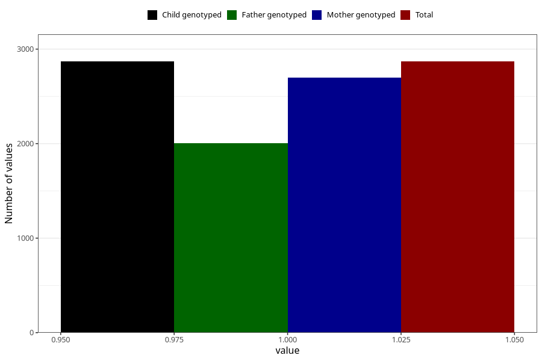

# contraception_used_other
Variable mapping to `AA39` in `Skjema1_v12`.
- Number of values:

| Value | Total | Child genotyped | Mother genotyped | Father genotyped |
| ----- | ----- | --------------- | ---------------- | ---------------- |
| Missing | 78136 | 78136 | 73917 | 51602 |
| Non-missing | 2869 | 2869 | 2700 | 2002 |
| 1 | 2869 | 2869 | 2700 | 2002 |

