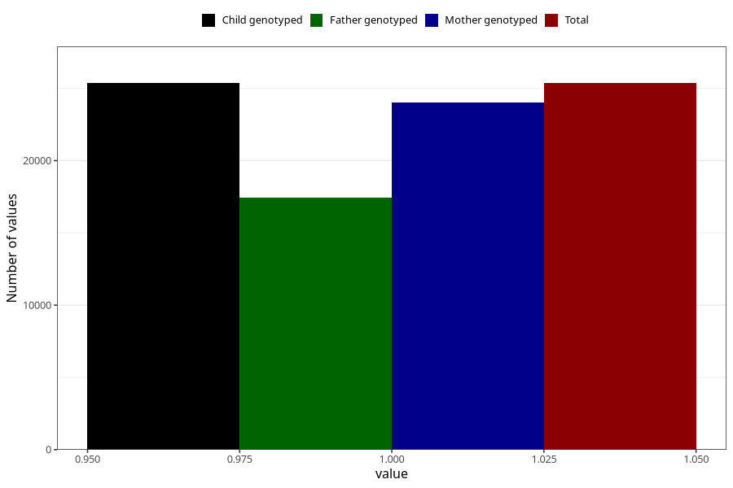

# contraception_used_pill
Variable mapping to `AA34` in `Skjema1_v12`.
- Number of values:

| Value | Total | Child genotyped | Mother genotyped | Father genotyped |
| ----- | ----- | --------------- | ---------------- | ---------------- |
| Missing | 55644 | 55644 | 52617 | 36163 |
| Non-missing | 25361 | 25361 | 24000 | 17441 |
| 1 | 25361 | 25361 | 24000 | 17441 |

