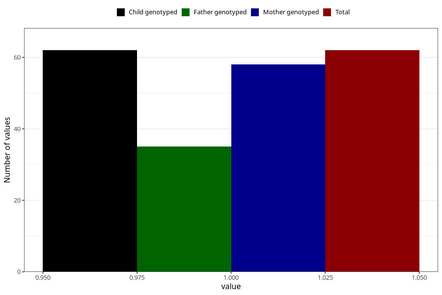

# contraception_used_spermicies
Variable mapping to `AA35` in `Skjema1_v12`.
- Number of values:

| Value | Total | Child genotyped | Mother genotyped | Father genotyped |
| ----- | ----- | --------------- | ---------------- | ---------------- |
| Missing | 80943 | 80943 | 76559 | 53569 |
| Non-missing | 62 | 62 | 58 | 35 |
| 1 | 62 | 62 | 58 | 35 |

