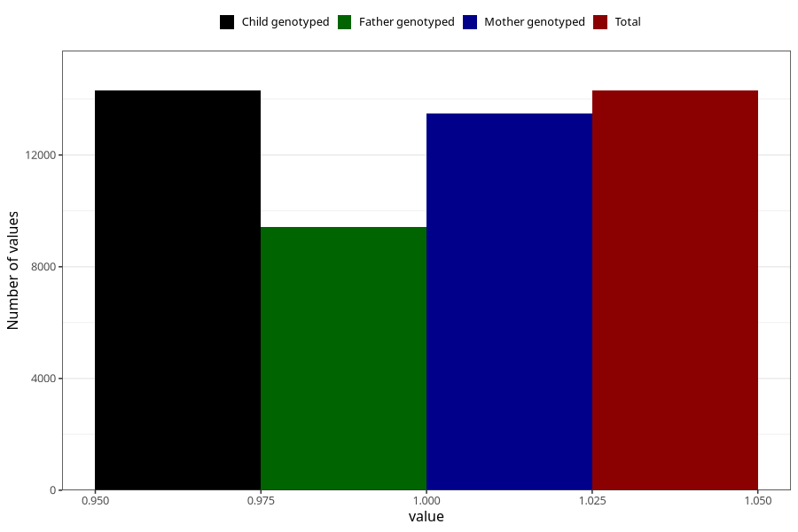

# contraception_used_withdrawal
Variable mapping to `AA37` in `Skjema1_v12`.
- Number of values:

| Value | Total | Child genotyped | Mother genotyped | Father genotyped |
| ----- | ----- | --------------- | ---------------- | ---------------- |
| Missing | 66700 | 66700 | 63116 | 44168 |
| Non-missing | 14305 | 14305 | 13501 | 9436 |
| 1 | 14305 | 14305 | 13501 | 9436 |

