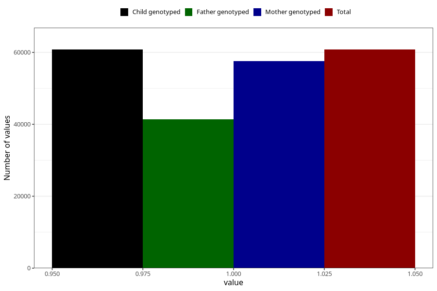

# lost_periods_no
Variable mapping to `AA17` in `Skjema1_v12`.
- Number of values:

| Value | Total | Child genotyped | Mother genotyped | Father genotyped |
| ----- | ----- | --------------- | ---------------- | ---------------- |
| Missing | 20221 | 20221 | 19102 | 12268 |
| Non-missing | 60784 | 60784 | 57515 | 41336 |
| 1 | 60784 | 60784 | 57515 | 41336 |

