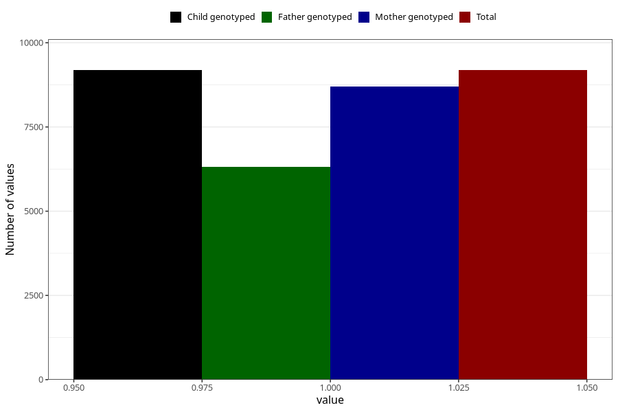

# lost_periods_previous_pregnancy
Variable mapping to `AA18` in `Skjema1_v12`.
- Number of values:

| Value | Total | Child genotyped | Mother genotyped | Father genotyped |
| ----- | ----- | --------------- | ---------------- | ---------------- |
| Missing | 71819 | 71819 | 67917 | 47288 |
| Non-missing | 9186 | 9186 | 8700 | 6316 |
| 1 | 9186 | 9186 | 8700 | 6316 |

