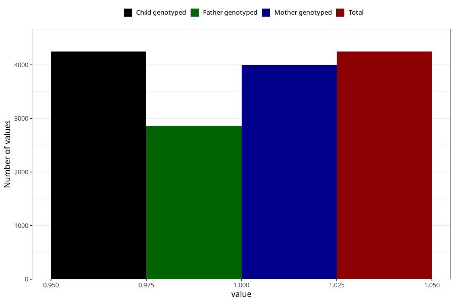

# lost_periods_yes_other
Variable mapping to `AA19` in `Skjema1_v12`.
- Number of values:

| Value | Total | Child genotyped | Mother genotyped | Father genotyped |
| ----- | ----- | --------------- | ---------------- | ---------------- |
| Missing | 76758 | 76758 | 72626 | 50736 |
| Non-missing | 4247 | 4247 | 3991 | 2868 |
| 1 | 4247 | 4247 | 3991 | 2868 |

