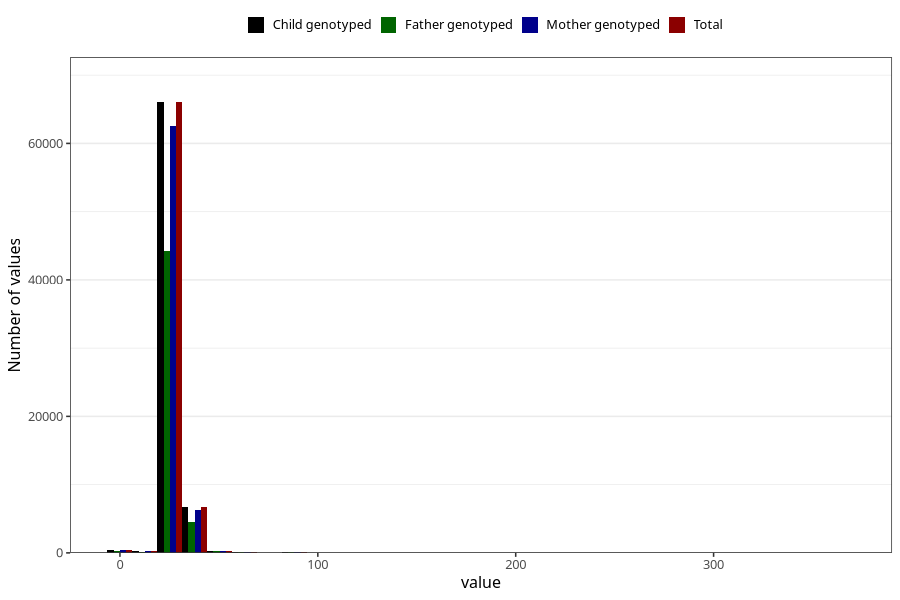

# menstrual_cycle_length
Variable mapping to `AA13` in `Skjema1_v12`.
Variable mapping to `AA13` in `Skjema1_v12`.
- Number of values:

| Value | Total | Child genotyped | Mother genotyped | Father genotyped |
| ----- | ----- | --------------- | ---------------- | ---------------- |
| Missing | 6852 | 6852 | 6436 | 4026 |
| Non-missing | 74153 | 74153 | 70181 | 49578 |
| 25th percentile | 28 | 28 | 28 | 28 |
| 50th percentile | 28 | 28 | 28 | 28 |
| 75th percentile | 30 | 30 | 30 | 30 |
| Mean | 28.588957965288 | 28.588957965288 | 28.5841609552443 | 28.6490782201783 |
| Standard deviation | 5.26339031191372 | 5.26339031191372 | 5.25167692052722 | 5.17239882849888 |
| N | 74153 | 74153 | 70181 | 49578 |

