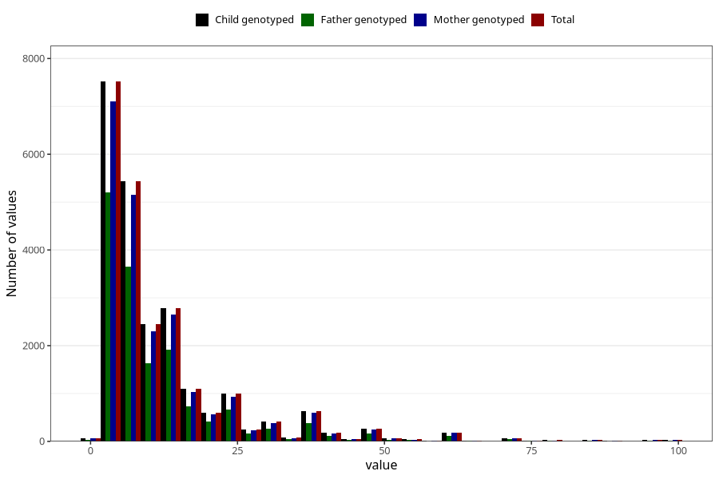

# months_intercourse_without_contraception_2
Variable mapping to `AA48` in `Skjema1_v12`.
- Number of values:

| Value | Total | Child genotyped | Mother genotyped | Father genotyped |
| ----- | ----- | --------------- | ---------------- | ---------------- |
| Missing | 57698 | 57698 | 54556 | 37822 |
| Non-missing | 23307 | 23307 | 22061 | 15782 |
| 25th percentile | 5 | 5 | 5 | 5 |
| 50th percentile | 7 | 7 | 7 | 7 |
| 75th percentile | 14 | 14 | 14 | 13 |
| Mean | 12.1766422104947 | 12.1766422104947 | 12.2064729613345 | 11.9288429856799 |
| Standard deviation | 12.6004685742453 | 12.6004685742453 | 12.6579889158398 | 12.2343337959828 |
| N | 23307 | 23307 | 22061 | 15782 |

