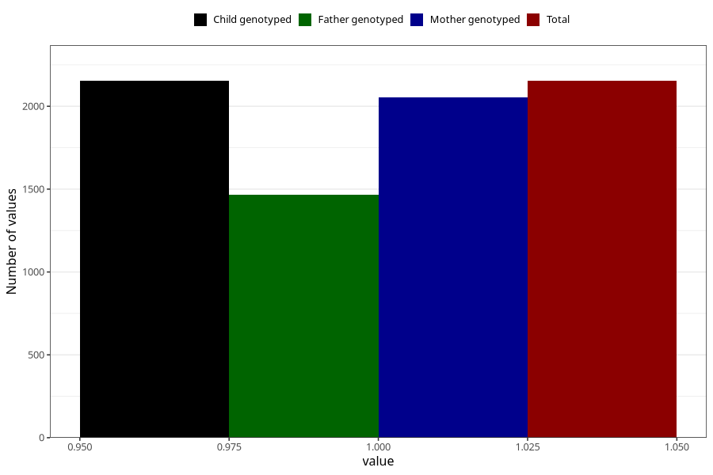

# treated_for_infertility_hormone_treatment
Variable mapping to `AA75` in `Skjema1_v12`.
- Number of values:

| Value | Total | Child genotyped | Mother genotyped | Father genotyped |
| ----- | ----- | --------------- | ---------------- | ---------------- |
| Missing | 78852 | 78852 | 74563 | 52137 |
| Non-missing | 2153 | 2153 | 2054 | 1467 |
| 1 | 2153 | 2153 | 2054 | 1467 |

