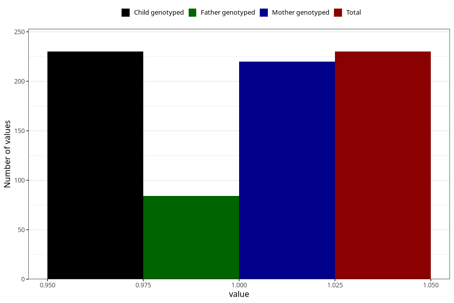

# treated_for_infertility_insemination
Variable mapping to `AA77` in `Skjema1_v12`.
- Number of values:

| Value | Total | Child genotyped | Mother genotyped | Father genotyped |
| ----- | ----- | --------------- | ---------------- | ---------------- |
| Missing | 80775 | 80775 | 76397 | 53520 |
| Non-missing | 230 | 230 | 220 | 84 |
| 1 | 230 | 230 | 220 | 84 |

