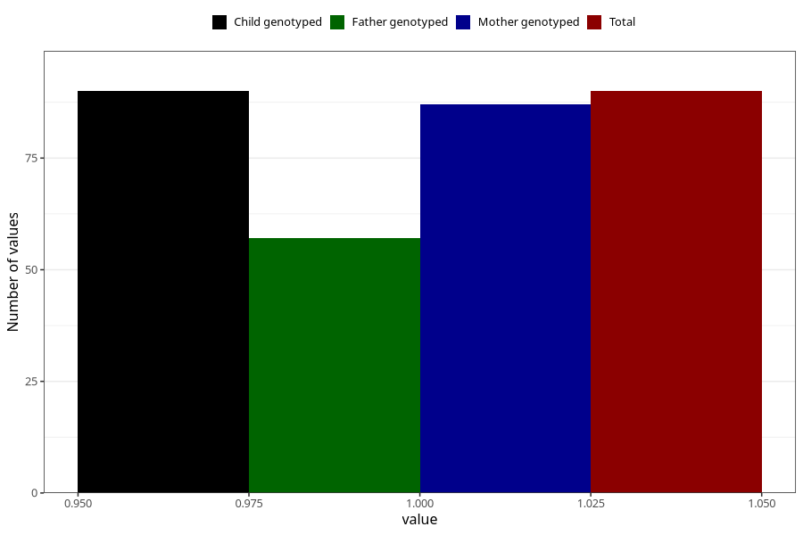

# treated_for_infertility_medication_endometriosis
Variable mapping to `AA73` in `Skjema1_v12`.
- Number of values:

| Value | Total | Child genotyped | Mother genotyped | Father genotyped |
| ----- | ----- | --------------- | ---------------- | ---------------- |
| Missing | 80915 | 80915 | 76530 | 53547 |
| Non-missing | 90 | 90 | 87 | 57 |
| 1 | 90 | 90 | 87 | 57 |

