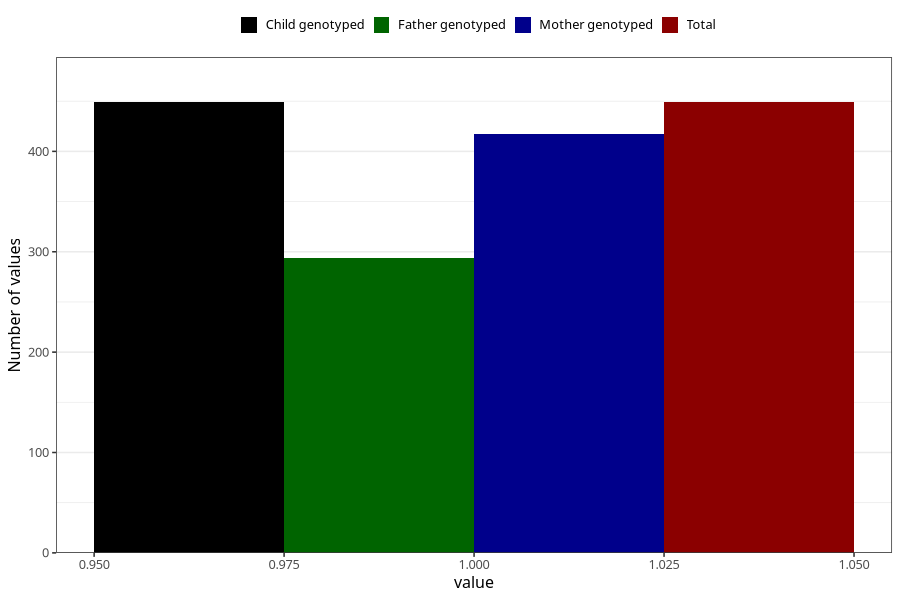

# treated_for_infertility_other
Variable mapping to `AA81` in `Skjema1_v12`.
- Number of values:

| Value | Total | Child genotyped | Mother genotyped | Father genotyped |
| ----- | ----- | --------------- | ---------------- | ---------------- |
| Missing | 80556 | 80556 | 76200 | 53310 |
| Non-missing | 449 | 449 | 417 | 294 |
| 1 | 449 | 449 | 417 | 294 |

