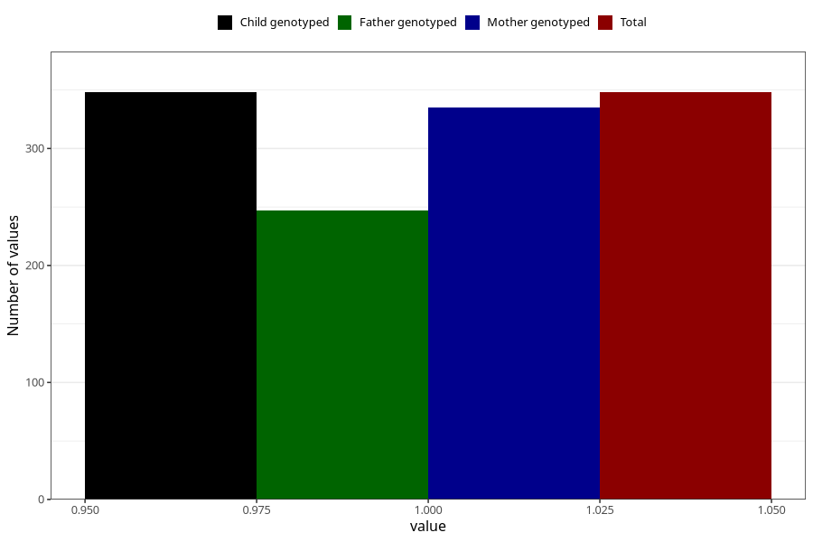

# treated_for_infertility_other_surgery
Variable mapping to `AA71` in `Skjema1_v12`.
- Number of values:

| Value | Total | Child genotyped | Mother genotyped | Father genotyped |
| ----- | ----- | --------------- | ---------------- | ---------------- |
| Missing | 80657 | 80657 | 76282 | 53357 |
| Non-missing | 348 | 348 | 335 | 247 |
| 1 | 348 | 348 | 335 | 247 |

