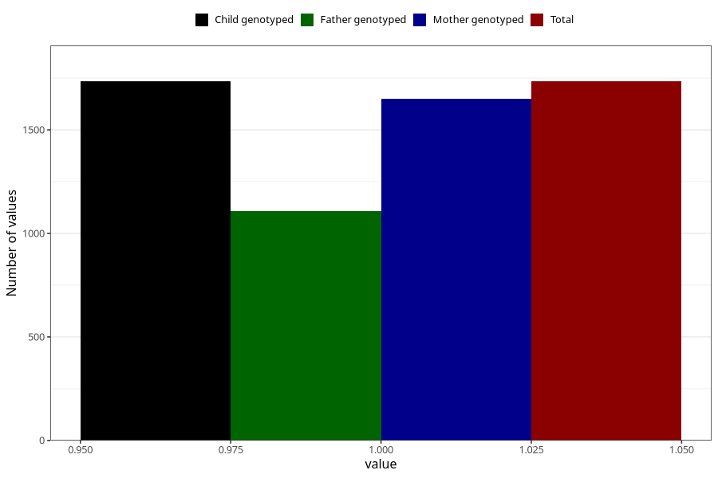

# treated_for_infertility_previous_hormone_treatment
Variable mapping to `AA74` in `Skjema1_v12`.
- Number of values:

| Value | Total | Child genotyped | Mother genotyped | Father genotyped |
| ----- | ----- | --------------- | ---------------- | ---------------- |
| Missing | 79271 | 79271 | 74967 | 52498 |
| Non-missing | 1734 | 1734 | 1650 | 1106 |
| 1 | 1734 | 1734 | 1650 | 1106 |

