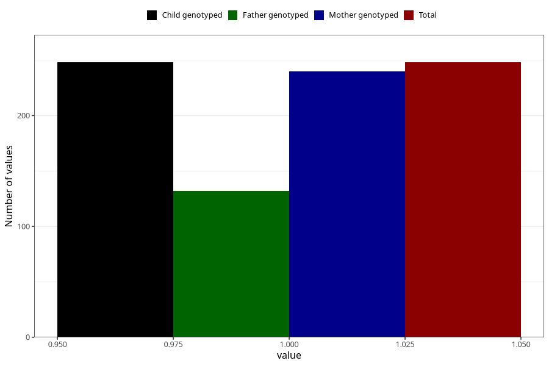

# treated_for_infertility_previous_insemination
Variable mapping to `AA76` in `Skjema1_v12`.
- Number of values:

| Value | Total | Child genotyped | Mother genotyped | Father genotyped |
| ----- | ----- | --------------- | ---------------- | ---------------- |
| Missing | 80757 | 80757 | 76377 | 53472 |
| Non-missing | 248 | 248 | 240 | 132 |
| 1 | 248 | 248 | 240 | 132 |

