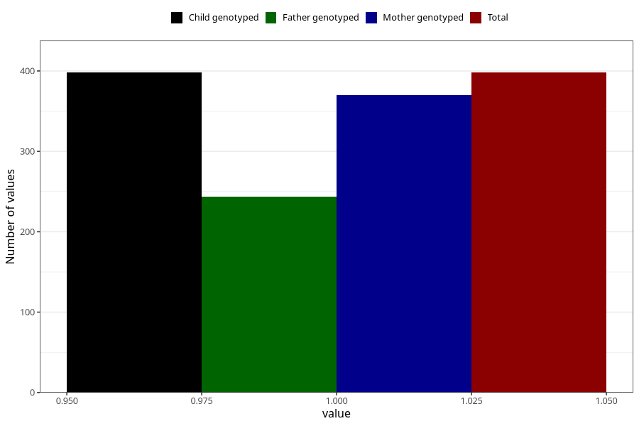

# treated_for_infertility_previous_other
Variable mapping to `AA80` in `Skjema1_v12`.
- Number of values:

| Value | Total | Child genotyped | Mother genotyped | Father genotyped |
| ----- | ----- | --------------- | ---------------- | ---------------- |
| Missing | 80607 | 80607 | 76247 | 53360 |
| Non-missing | 398 | 398 | 370 | 244 |
| 1 | 398 | 398 | 370 | 244 |

