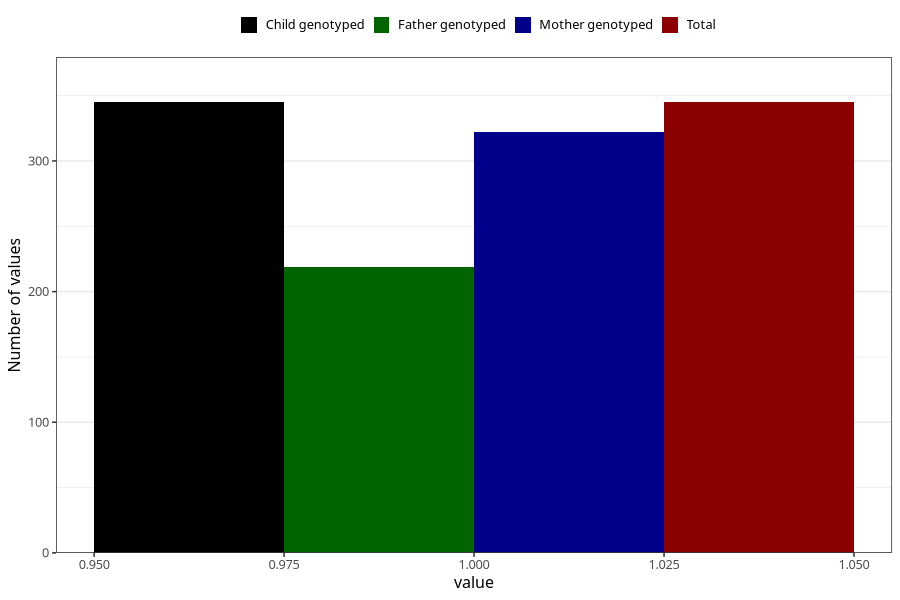

# treated_for_infertility_previous_other_surgery
Variable mapping to `AA70` in `Skjema1_v12`.
- Number of values:

| Value | Total | Child genotyped | Mother genotyped | Father genotyped |
| ----- | ----- | --------------- | ---------------- | ---------------- |
| Missing | 80660 | 80660 | 76295 | 53385 |
| Non-missing | 345 | 345 | 322 | 219 |
| 1 | 345 | 345 | 322 | 219 |

