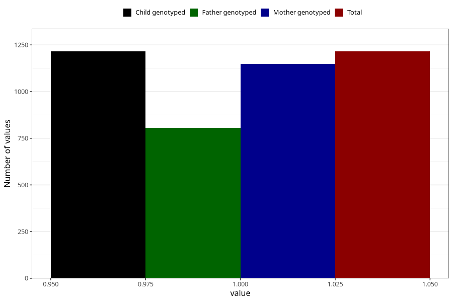

# treated_for_infertility_previous_test_tube
Variable mapping to `AA78` in `Skjema1_v12`.
- Number of values:

| Value | Total | Child genotyped | Mother genotyped | Father genotyped |
| ----- | ----- | --------------- | ---------------- | ---------------- |
| Missing | 79790 | 79790 | 75470 | 52798 |
| Non-missing | 1215 | 1215 | 1147 | 806 |
| 1 | 1215 | 1215 | 1147 | 806 |

