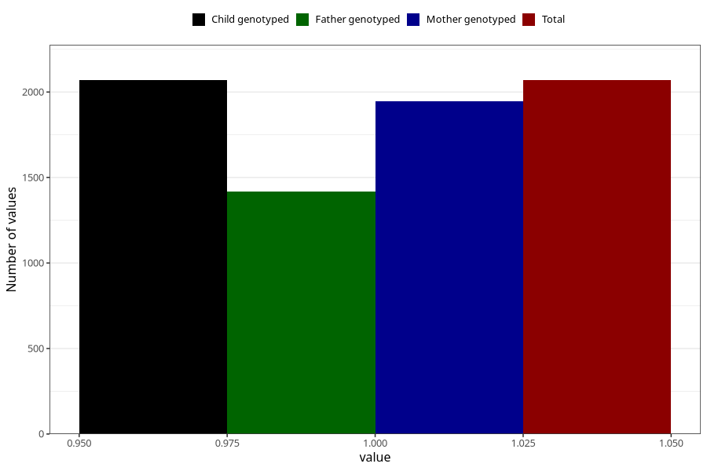

# treated_for_infertility_test_tube
Variable mapping to `AA79` in `Skjema1_v12`.
- Number of values:

| Value | Total | Child genotyped | Mother genotyped | Father genotyped |
| ----- | ----- | --------------- | ---------------- | ---------------- |
| Missing | 78936 | 78936 | 74670 | 52186 |
| Non-missing | 2069 | 2069 | 1947 | 1418 |
| 1 | 2069 | 2069 | 1947 | 1418 |

