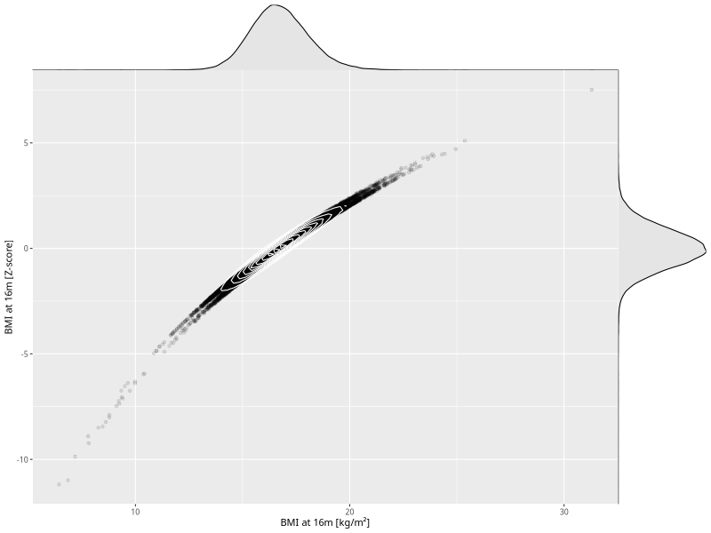

## BMI at 16m

| Name | # Children | # Mothers | # Fathers | # Total |
| ---- | ---------- | --------- | --------- | ------- |
| bmi_16m | 43663 | 41085 | 30265 | 115013 |
| z_bmi_16m | 43659 | 41081 | 30262 | 115002 |

- Formula: `bmi_16m ~ fp(pregnancy_duration_1)`
- Sigma formula: ` ~ pregnancy_duration_1`
- Distribution: `LOGNO`
- Normalization: `centiles.pred` Z-scores

