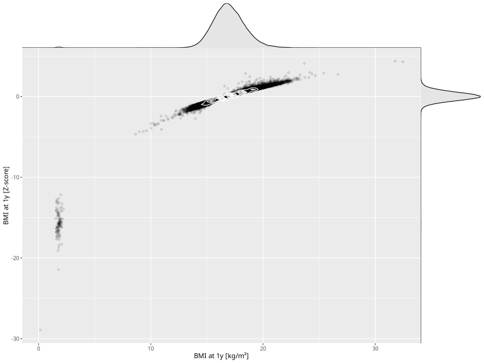

## BMI at 1y

| Name | # Children | # Mothers | # Fathers | # Total |
| ---- | ---------- | --------- | --------- | ------- |
| bmi_1y | 57932 | 54609 | 38889 | 151430 |
| z_bmi_1y | 57926 | 54603 | 38885 | 151414 |

- Formula: `bmi_1y ~ fp(pregnancy_duration_1)`
- Sigma formula: ` ~ pregnancy_duration_1`
- Distribution: `LOGNO`
- Normalization: `centiles.pred` Z-scores

