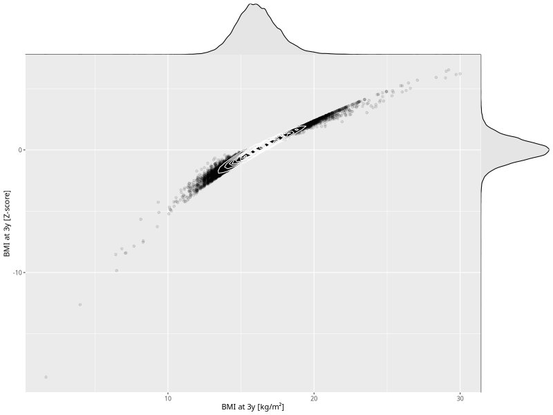

## BMI at 3y

| Name | # Children | # Mothers | # Fathers | # Total |
| ---- | ---------- | --------- | --------- | ------- |
| bmi_3y | 44133 | 41478 | 30622 | 116233 |
| z_bmi_3y | 44131 | 41476 | 30620 | 116227 |

- Formula: `bmi_3y ~ fp(pregnancy_duration_1)`
- Sigma formula: ` ~ pregnancy_duration_1`
- Distribution: `LOGNO`
- Normalization: `centiles.pred` Z-scores

