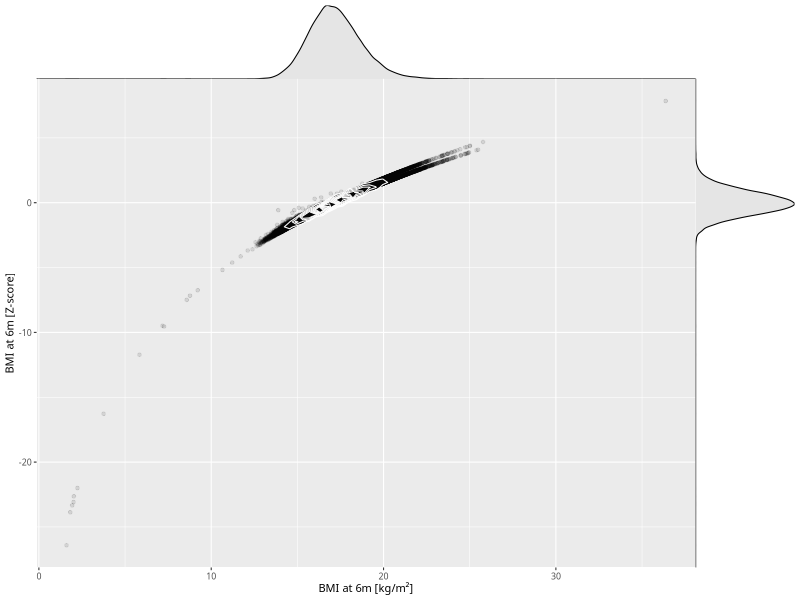

## BMI at 6m

| Name | # Children | # Mothers | # Fathers | # Total |
| ---- | ---------- | --------- | --------- | ------- |
| bmi_6m | 66369 | 62575 | 44303 | 173247 |
| z_bmi_6m | 66364 | 62570 | 44300 | 173234 |

- Formula: `bmi_6m ~ fp(pregnancy_duration_1)`
- Sigma formula: ` ~ pregnancy_duration_1`
- Distribution: `LOGNO`
- Normalization: `centiles.pred` Z-scores

