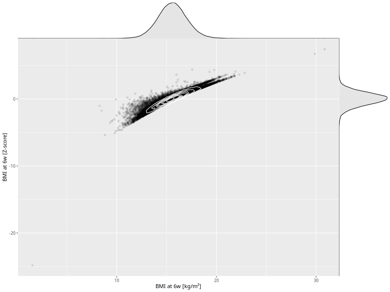

## BMI at 6w

| Name | # Children | # Mothers | # Fathers | # Total |
| ---- | ---------- | --------- | --------- | ------- |
| bmi_6w | 46641 | 43897 | 32334 | 122872 |
| z_bmi_6w | 46638 | 43894 | 32331 | 122863 |

- Formula: `bmi_6w ~ fp(pregnancy_duration_1)`
- Sigma formula: ` ~ pregnancy_duration_1`
- Distribution: `LOGNO`
- Normalization: `centiles.pred` Z-scores

