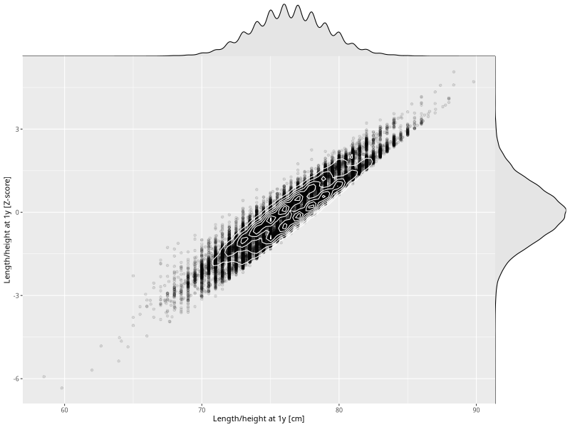

## Length/height at 1y

| Name | # Children | # Mothers | # Fathers | # Total |
| ---- | ---------- | --------- | --------- | ------- |
| length_1y | 58203 | 54863 | 39078 | 152144 |
| z_length_1y | 58200 | 54860 | 39076 | 152136 |

- Formula: `length_1y ~ fp(pregnancy_duration_1)`
- Sigma formula: ` ~ pregnancy_duration_1`
- Distribution: `NO`
- Normalization: `centiles.pred` Z-scores

