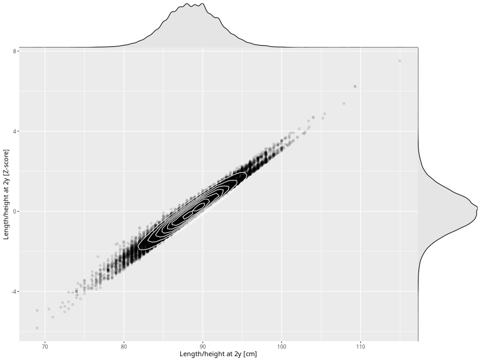

## Length/height at 2y

| Name | # Children | # Mothers | # Fathers | # Total |
| ---- | ---------- | --------- | --------- | ------- |
| length_2y | 44247 | 41645 | 30665 | 116557 |
| z_length_2y | 44246 | 41644 | 30664 | 116554 |

- Formula: `length_2y ~ fp(pregnancy_duration_1)`
- Sigma formula: ` ~ pregnancy_duration_1`
- Distribution: `NO`
- Normalization: `centiles.pred` Z-scores

