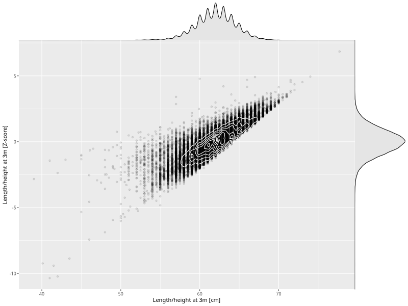

## Length/height at 3m

| Name | # Children | # Mothers | # Fathers | # Total |
| ---- | ---------- | --------- | --------- | ------- |
| length_3m | 65653 | 61900 | 43815 | 171368 |
| z_length_3m | 65652 | 61899 | 43814 | 171365 |

- Formula: `length_3m ~ fp(pregnancy_duration_1)`
- Sigma formula: ` ~ pregnancy_duration_1`
- Distribution: `NO`
- Normalization: `centiles.pred` Z-scores

