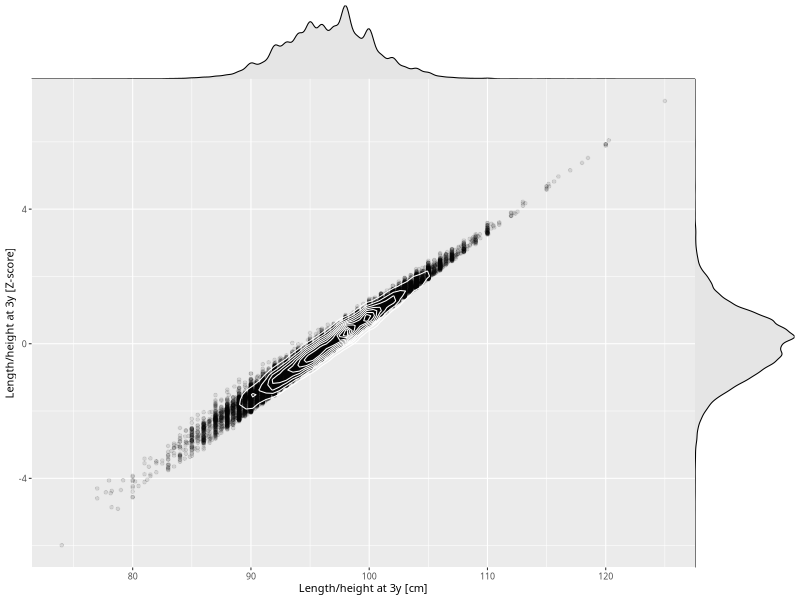

## Length/height at 3y

| Name | # Children | # Mothers | # Fathers | # Total |
| ---- | ---------- | --------- | --------- | ------- |
| length_3y | 45167 | 42468 | 31346 | 118981 |
| z_length_3y | 45158 | 42459 | 31344 | 118961 |

- Formula: `length_3y ~ fp(pregnancy_duration_1)`
- Sigma formula: ` ~ pregnancy_duration_1`
- Distribution: `NO`
- Normalization: `centiles.pred` Z-scores

