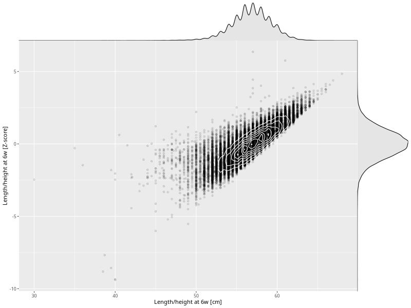

## Length/height at 6w

| Name | # Children | # Mothers | # Fathers | # Total |
| ---- | ---------- | --------- | --------- | ------- |
| length_6w | 46836 | 44084 | 32457 | 123377 |
| z_length_6w | 46836 | 44084 | 32457 | 123377 |

- Formula: `length_6w ~ fp(pregnancy_duration_1)`
- Sigma formula: ` ~ pregnancy_duration_1`
- Distribution: `NO`
- Normalization: `centiles.pred` Z-scores

