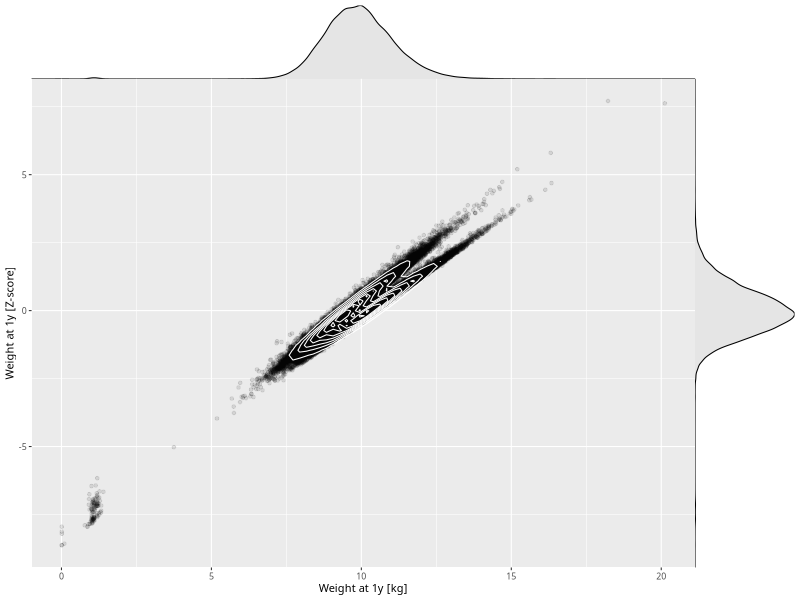

## Weight at 1y

| Name | # Children | # Mothers | # Fathers | # Total |
| ---- | ---------- | --------- | --------- | ------- |
| weight_1y | 58439 | 55089 | 39221 | 152749 |
| z_weight_1y | 58437 | 55087 | 39219 | 152743 |

- Formula: `weight_1y ~ fp(pregnancy_duration_1)`
- Sigma formula: ` ~ pregnancy_duration_1`
- Distribution: `NO`
- Normalization: `centiles.pred` Z-scores

