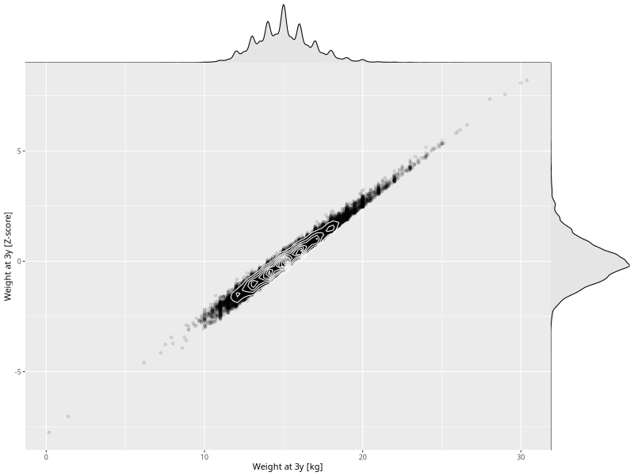

## Weight at 3y

| Name | # Children | # Mothers | # Fathers | # Total |
| ---- | ---------- | --------- | --------- | ------- |
| weight_3y | 45631 | 42877 | 31618 | 120126 |
| z_weight_3y | 45627 | 42874 | 31617 | 120118 |

- Formula: `weight_3y ~ fp(pregnancy_duration_1)`
- Sigma formula: ` ~ pregnancy_duration_1`
- Distribution: `NO`
- Normalization: `centiles.pred` Z-scores

