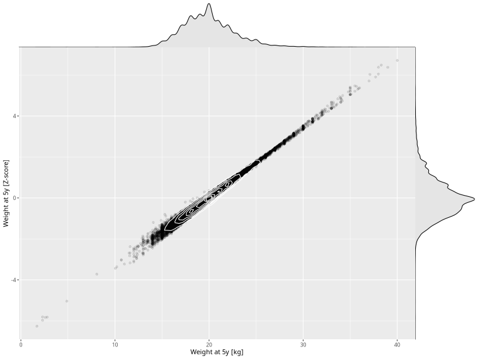

## Weight at 5y

| Name | # Children | # Mothers | # Fathers | # Total |
| ---- | ---------- | --------- | --------- | ------- |
| weight_5y | 36493 | 34290 | 25848 | 96631 |
| z_weight_5y | 36489 | 34287 | 25845 | 96621 |

- Formula: `weight_5y ~ fp(pregnancy_duration_1)`
- Sigma formula: ` ~ pregnancy_duration_1`
- Distribution: `NO`
- Normalization: `centiles.pred` Z-scores

