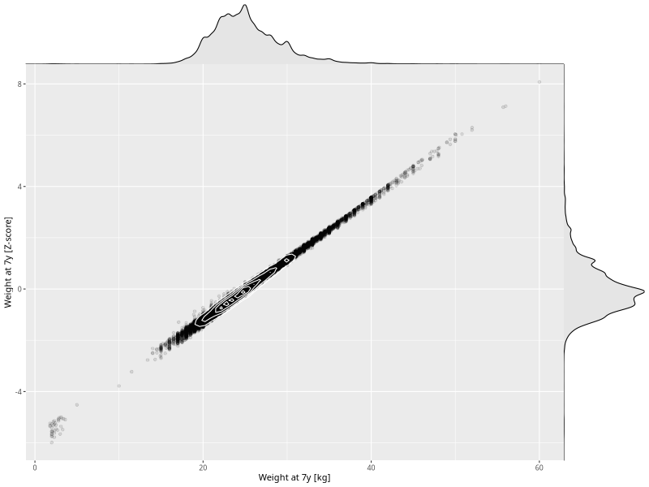

## Weight at 7y

| Name | # Children | # Mothers | # Fathers | # Total |
| ---- | ---------- | --------- | --------- | ------- |
| weight_7y | 37737 | 35542 | 25605 | 98884 |
| z_weight_7y | 37736 | 35541 | 25605 | 98882 |

- Formula: `weight_7y ~ fp(pregnancy_duration_1)`
- Sigma formula: ` ~ pregnancy_duration_1`
- Distribution: `NO`
- Normalization: `centiles.pred` Z-scores

