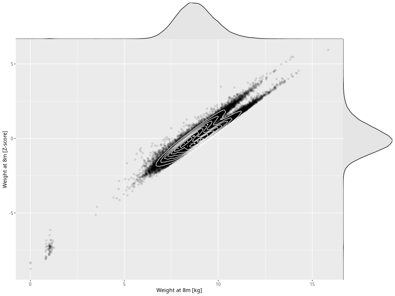

## Weight at 8m

| Name | # Children | # Mothers | # Fathers | # Total |
| ---- | ---------- | --------- | --------- | ------- |
| weight_8m | 58542 | 55193 | 39277 | 153012 |
| z_weight_8m | 58540 | 55191 | 39275 | 153006 |

- Formula: `weight_8m ~ fp(pregnancy_duration_1)`
- Sigma formula: ` ~ pregnancy_duration_1`
- Distribution: `NO`
- Normalization: `centiles.pred` Z-scores

