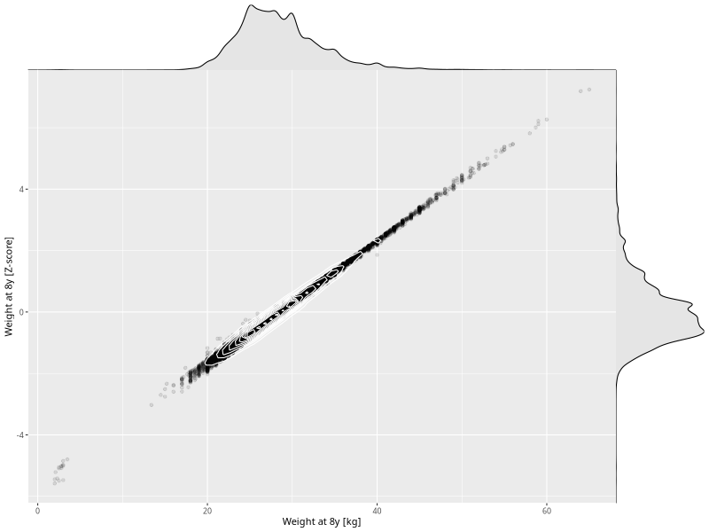

## Weight at 8y

| Name | # Children | # Mothers | # Fathers | # Total |
| ---- | ---------- | --------- | --------- | ------- |
| weight_8y | 28774 | 27017 | 20170 | 75961 |
| z_weight_8y | 28774 | 27017 | 20170 | 75961 |

- Formula: `weight_8y ~ fp(pregnancy_duration_1)`
- Sigma formula: ` ~ pregnancy_duration_1`
- Distribution: `NO`
- Normalization: `centiles.pred` Z-scores

